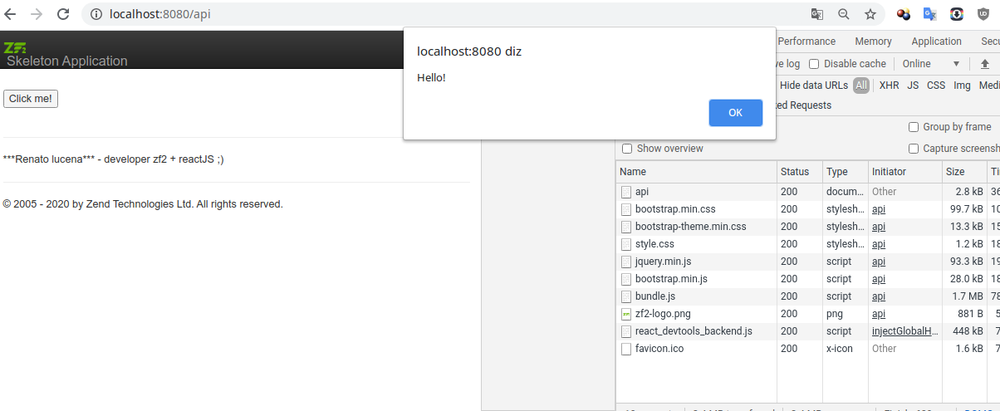
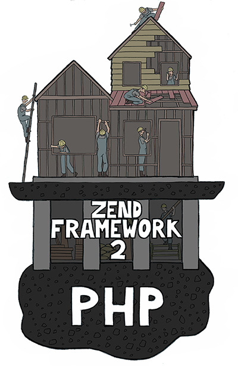

ZendSkeletonApplication
=======================

## student zend framework 2 development, implement reactjs
<p align="center"><a href="https://github.com/lucenarenato" target="_blank"></a></p>

`composer global require composer/composer`
`npm install`

`npm run dev`

- http://localhost:8080/api

```bash
$ cd path/to/install
$ php -S 0.0.0.0:8080 -t public/ public/index.php
# OR use the composer alias:
$ composer serve
```

<p align="center"><a href="https://github.com/lucenarenato" target="_blank"></a></p>


rm `"siad007/zf2-reactjs-module": "dev-master"`
- "reactjs/react-php-v8js": "^2.0"

- https://packagist.org/packages/zendframework/zend-component-installer
- https://packagist.org/packages/zendframework/zend-mvc#2.5.0
- composer require laminas/laminas-json

sudo apt install webpack
webpack -w


removido layout

<?php $script =  $this->inlineScript();
              $script->appendFile($this->basePath() . '/js/app.js');
              //$script->appendFile($this->basePath() . '../App/index.js');

              echo $script;
        ?>

## Renato Lucena 12/2020        